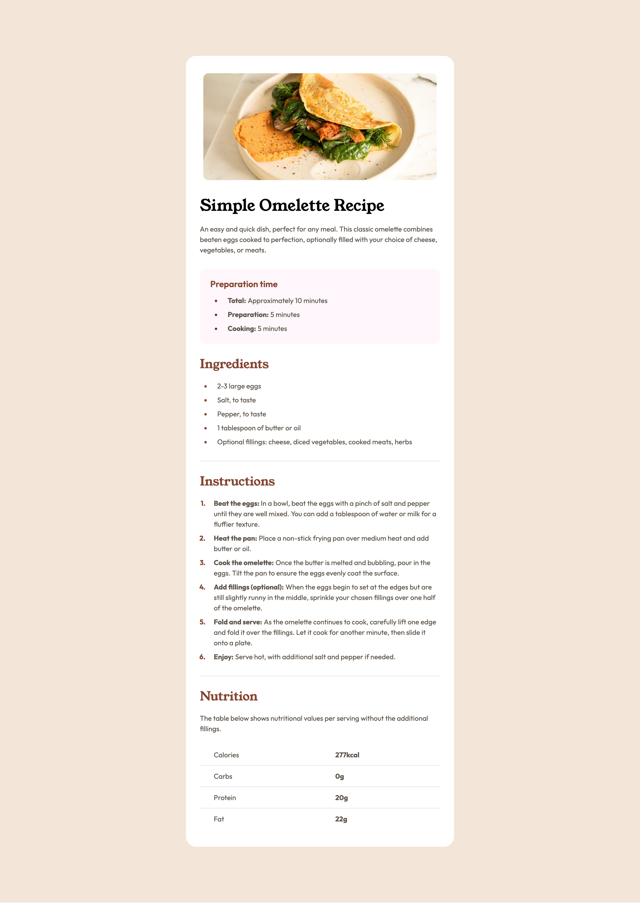

# Frontend Mentor - Recipe page solution

This is a solution to the [Recipe page challenge on Frontend Mentor](https://www.frontendmentor.io/challenges/recipe-page-KiTsR8QQKm). Frontend Mentor challenges help you improve your coding skills by building realistic projects.

## Table of contents

- [Overview](#overview)
  - [The challenge](#the-challenge)
  - [Screenshot](#screenshot)
  - [Links](#links)
- [My process](#my-process)
  - [Built with](#built-with)
  - [What I learned](#what-i-learned)
- [Author](#author)
- [Acknowledgments](#acknowledgments)

**Note: Delete this note and update the table of contents based on what sections you keep.**

## Overview

### The challenge

The project required building a clean, responsive recipe card based on a provided design. It focuses on presenting text data, structured lists, and numerical tables in an elegant, mobile-friendly format.

### Screenshot

### Links

- Solution URL: [Add solution URL here](https://github.com/bartekluczak/recipe-page)
- Live Site URL: [Add live site URL here](https://recipe-page-bl.netlify.app/)

## My process

### Built with

- Semantic HTML5 markup
- CSS custom properties
- Flexbox
- Mobile-first workflow

### What I learned

While building this recipe page challenge, I focused on writing scalable, clean code and mastering responsive layouts. Here are the key technical concepts I practiced:

- **Advanced CSS Variables (`:root`):** Managed the design system efficiently by centralizing design tokens for colors, precise spacing scales, and complex typography presets.
- **Modern Layouts with Flexbox:** Used Flexbox on lists (`ul`, `ol`) with the `gap` property to handle vertical spacing dynamically and cleanly.
- **Responsive Desktop Centering:** Implemented mobile-first design, using desktop media queries with a combination of `body { display: flex; justify-content: center; }` and a `max-width` container to center the card perfectly on large screens.
- **List Customization:** Styled ordered and unordered lists using the advanced `::marker` pseudo-element to match custom brand colors and font weights.
- **Semantic HTML5 Elements:** Structured the page using clean, meaningful layout elements like `<main>`, `<article>`, `<section>`, and integrated a standard accessible `<table>` for nutritional data.

## Author

- Github - [Bartek Łuczak](https://github.com/bartekluczak)
- Frontend Mentor - [@bartekluczak](https://www.frontendmentor.io/profile/bartekluczak)
